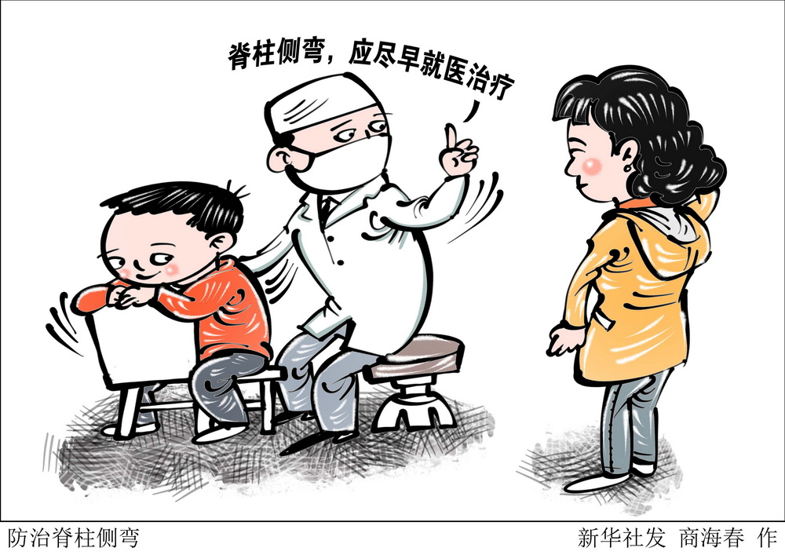

# spine-scoliosis-prevention
# 参与大模型实战营 GitHub 仓库（https://github.com/InternLM/Tutorial）
# 中学生脊柱侧弯预干预模型

本项目旨在通过大数据和机器学习技术构建一个中学生脊柱侧弯预干预模型，帮助学校和家长及时发现和干预中学生脊柱侧弯问题。项目不仅能识别和预测脊柱侧弯风险，还能提供个性化的预防和干预建议，为学生的健康成长保驾护航
## 项目介绍

### 目标
- 脊柱侧弯识别：通过图像处理和机器学习技术，识别中学生脊柱侧弯的早期症状。
- 风险预测：基于历史数据和多种因素，预测中学生未来可能出现的脊柱侧弯风险。
- 个性化干预：根据学生的具体情况，提供个性化的预防和干预建议。

### 使用技术

- 编程语言：主要使用 Python
- 框架和库：TensorFlow、Keras、OpenCV、scikit-learn
- 工具：Git、GitHub、VS Code、Jupyter Notebook

### 模型特点
- **数据驱动**：模型基于大量学生健康数据进行训练，确保预测的准确性和可靠性。
- **个性化**：根据每个学生的具体情况提供个性化的干预建议。
- **易用性**：用户可以通过简单的界面或命令行与模型进行交互，获取预测和建议。

### 仓库结构

```plaintext
├── README.md         # 项目介绍
├── data              # 数据集
│   ├── raw           # 原始数据
│   └── processed     # 处理后的数据
├── notebooks         # Jupyter Notebook 文件
│   ├── data_preprocessing.ipynb
│   ├── model_training.ipynb
│   └── model_evaluation.ipynb
├── src               # 源代码
│   ├── data_preprocessing.py
│   ├── model.py
│   └── predict.py
├── results           # 结果文件
│   ├── figures       # 图表
│   └── reports       # 报告
└──心得体会
    ├──学习心得.md
    ├──项目总结.md
    └──其他.md
